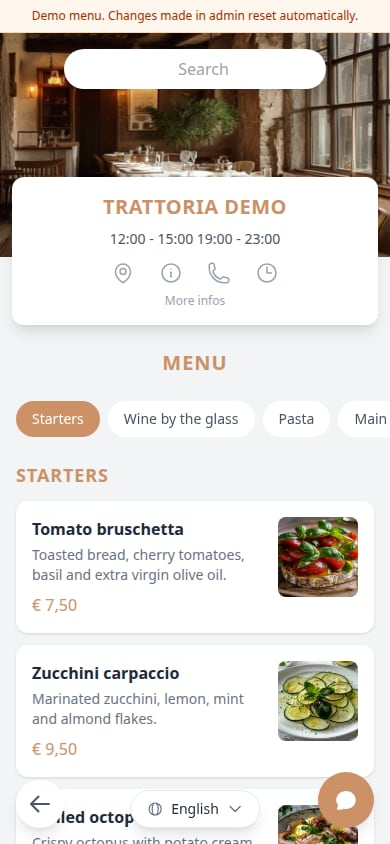
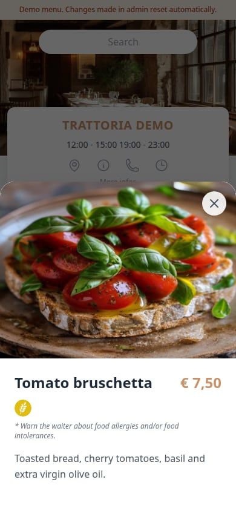
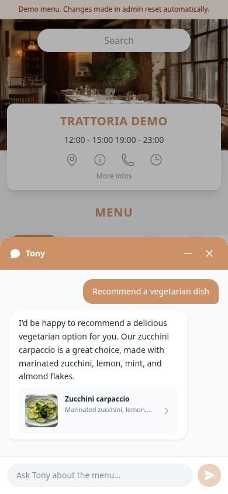
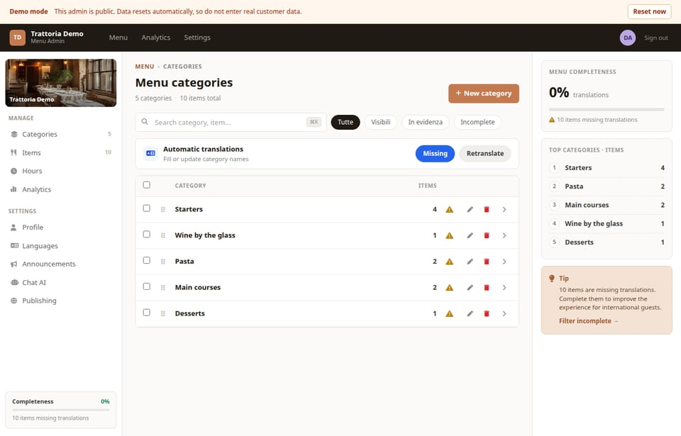

# Risto Menu

Self-hostable digital restaurant menu, built on Next.js + Cloudflare Workers
+ Cloudflare D1, with an optional OpenAI-powered AI assistant.

**One menu, one deploy.** Each instance serves a single restaurant — no
multi-tenancy, no slug in the URL, no admin restaurant picker. To run a
second restaurant, deploy the stack a second time. This keeps the codebase
small and the operator's mental model simple.

Diners scan a QR code → land on `/{locale}/menu` → browse a localized menu
in nine languages → optionally chat with an AI that knows your menu.
Restaurant owners manage everything from `/admin`.

## Live demo

Try the public demo: **https://risto-menu.andreabaccega.com**

- Public menu: https://risto-menu.andreabaccega.com/en/menu/
- Admin: https://risto-menu.andreabaccega.com/admin

The demo is editable and public. Data resets automatically, so do not enter real customer data.
Tony, the menu assistant, is enabled with a daily usage cap for the demo.

<table>
  <tr>
    <td></td>
    <td></td>
    <td></td>
  </tr>
  <tr>
    <td colspan="3"></td>
  </tr>
</table>

## Status

Source-available. Single-tenant. The multi-tenant version of this repo lived
through April 2026; the single-tenant collapse happened on `main`.

## License

[PolyForm Noncommercial 1.0.0](LICENSE) — free for personal, non-commercial,
academic, charity, and government use.

**Commercial use** (running it for a paying restaurant, hosting it as a
service, embedding it in a paid product) requires a separate license. See
[COMMERCIAL.md](COMMERCIAL.md).

## Stack

| Component | What |
|---|---|
| `web/` | Next.js 16 (App Router), deployed to Cloudflare Pages |
| `backend/` | Hono API on Cloudflare Workers, Drizzle ORM over Cloudflare D1 |
| `web/workers/chat/` | Separate Cloudflare Worker for the AI chat assistant (SSE streaming, OpenAI tool-calls) |
| `packages/schemas/` | Shared Zod schemas (`@menu/schemas`) |
| Auth | Cloudflare Access — admin login via Google/GitHub/email OTP/SAML/etc., JWT verified by backend |
| Storage | Cloudflare R2 (images), Cloudflare KV (chat menu cache) |

## Self-hosting

Full walkthrough: **[docs/self-hosting.md](docs/self-hosting.md)**.

TL;DR for someone with a Cloudflare account (Zero Trust enabled) ready:

```bash
git clone https://github.com/vekexasia/risto-menu.git
cd risto-menu

npm ci
cd web/workers/chat && npm ci && cd -

# Copy env templates and fill in your IDs / keys
cp backend/wrangler.toml.example          backend/wrangler.toml
cp backend/.dev.vars.example              backend/.dev.vars
cp web/.env.local.example                 web/.env.local
cp web/workers/chat/wrangler.toml.example web/workers/chat/wrangler.toml
cp web/workers/chat/.dev.vars.example     web/workers/chat/.dev.vars

# Provision D1 + KV (commands return IDs to paste back into wrangler.toml)
cd backend && npx wrangler d1 create menu-db
cd ../web/workers/chat && npx wrangler kv namespace create MENU_CACHE
cd ../../..

# Apply migrations and run
cd backend && npx wrangler d1 migrations apply menu-db --local && npm run dev
# new terminal:
cd web/workers/chat && npm run dev
# new terminal:
cd web && npm run dev
```

Open <http://localhost:3000/admin> (in production, Cloudflare Access redirects you to login)
and edit your menu. The first time you run the backend migration it seeds a
default `settings` row with name "My Restaurant" — change it under
`/admin?s=settings`.

## Common commands

```bash
# Frontend
cd web && npm run dev
cd web && npm run build
cd web && npm run test:run
cd web && npm run deploy:cf      # CF_PAGES_PROJECT defaults to "menu"

# Backend API
cd backend && npm run dev
cd backend && npm run check
cd backend && npm run test:run
cd backend && npm run deploy

# Chat worker
cd web/workers/chat && npm run dev
cd web/workers/chat && npm run test:run
cd web/workers/chat && npm run deploy
```

## Documentation

- [Self-hosting guide](docs/self-hosting.md) — deploy your own copy
- [Secrets & env vars](docs/secrets-and-env-vars.md) — full reference
- [Architecture & coding conventions](CLAUDE.md)
- [Contributing](CONTRIBUTING.md)
- [Security policy](SECURITY.md)
- [Code of conduct](CODE_OF_CONDUCT.md)

## Contact

- Issues / bugs / features → GitHub issues
- Security → see [SECURITY.md](SECURITY.md)
- Commercial licensing → see [COMMERCIAL.md](COMMERCIAL.md)
